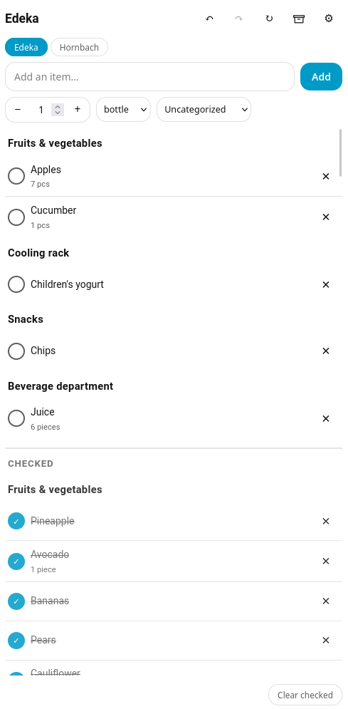

# 🛒 Grocery List for Home Assistant

**Shared, git-synced grocery lists with a beautiful mobile-first card — right inside Home Assistant.**

Stop juggling third-party apps and cloud accounts just to share a shopping list. Grocery List keeps your lists in a plain-Markdown git repository *you* own, adds a slick Lovelace card, structured quantities, categories, per-device undo/redo, and an archive — and it syncs across every Home Assistant instance in the household without ever leaving git conflict markers in your files.

> **git is only transport. The merge is ours.** Conflicts are resolved by a semantic three-way merge in Python, so your Markdown stays clean and readable everywhere (yes, even in Obsidian).

<p align="center">
  
</p>

---

## ✨ Why you'll like it

- **📝 Plain Markdown, fully yours** — one human-readable file per list. Edit on your phone, in Obsidian, in any text editor. No lock-in, no proprietary format.
- **🔄 Real multi-device sync** — every HA instance in the house sees the same lists. Add milk on the kitchen tablet, check it off on your phone.
- **🧠 Conflicts just work** — a semantic three-way merge (not a text merge) means simultaneous edits never corrupt your files. Deletions stick, checked-state wins sanely, no `<<<<<<<` markers.
- **🏠 Or go fully local** — don't want git? Run local-only mode: one shared list on one HA instance, persisted to disk, zero setup beyond a name.
- **🎛️ A card that feels native** — mobile-first, quick add bar, quantity stepper, categories, and a one-tap sync badge.
- **↩️ Per-device undo/redo** — every action is undoable, scoped to *your* device, backed by an op-log. Fat-fingered a delete? Undo it.
- **📦 Archive, not delete** — "clear checked" tucks items into a browsable archive you can restore from, kept out of git entirely.
- **🗣️ Voice & AI ready** — talk to your lists through Assist, and let LLM/MCP assistants read and edit them out of the box. *"Add two litres of milk to the shopping list."* No extra tokens, no config.
- **🌍 Localized** — ships in **English, German, Spanish, French, Italian, Dutch, Norwegian, Polish, Portuguese, and Swedish**.

---

## 📸 Screenshots

> _Screenshots coming soon._

| Lists & categories | Add with quantity | Archive & restore |
| --- | --- | --- |
|  |  |  |

---

## 🚀 Getting started

### 1. Install via HACS

1. In HACS, add this repository as a **custom repository** (category: *Integration*).
2. Search for **Grocery List** and install it.
3. **Restart Home Assistant.**

### 2. Add the integration

Go to **Settings → Devices & Services → Add Integration**, search for **Grocery List**, and pick a mode:

- **Local only (no sync)** — just name this instance and you're done.
- **Sync with a git repository** — connect a repo you control (GitHub, Codeberg, Forgejo, self-hosted…).

### 3. Drop the card on a dashboard

Add a **Custom: Grocery List Card** to any dashboard. That's it — the card ships *inside* the integration and registers itself automatically. There's no Lovelace resource to add by hand.

---

## 🧑‍🍳 Using the card

The card is your day-to-day cockpit:

- **List switcher** across the top to jump between shopping lists.
- **Quick-add bar** with a name field, a quantity stepper, and unit + category pickers.
- **Tap to check** items off — checked items sink to the bottom of their category so the active list stays front-and-center.
- **Inline editing** of names, quantities, and categories.
- **Toolbar** with undo, redo, sync-now, the archive view, and category management.
- **Sync badge** showing live status: *synced*, *pending*, *syncing*, *offline*, *error*, or *local*.
- **Clear checked** to sweep completed items into the archive in one tap.

### Structured quantities

Items can carry a quantity (value + unit). Built-in units include **pcs, g, kg, ml, L, pack, bottle, can, bunch** — each localized. Quantities render inline in the Markdown as a tidy `×2 kg` suffix.

### Categories

Group items under free-text categories (Produce, Dairy, …). Categories are ordered alphabetically, with uncategorized items last. They live entirely in the list content — no sidecar files.

### Undo / redo

Every change — add, edit, check, delete, clear, restore, even list create/rename/delete — is undoable and redoable. History is **per device identity** and never rewrites git history: undo/redo emit new commits.

### Archive

"Clear checked" moves completed items into a per-list archive you can browse and restore from. The archive is stored in Home Assistant (out of git), so it never clutters your synced Markdown.

---

## ⚙️ Configuration

### Local-only mode

Just an **instance name** (your "identity"). It's recorded with each item you add and scopes your undo/redo history. Lists are persisted to disk and survive restarts.

### Git-synced mode

The setup flow collects:

| Field | Notes |
| --- | --- |
| **Instance name** | Your identity; recorded on items, scopes undo/redo. |
| **Auth method** | SSH (recommended: a repo-scoped deploy key) or HTTPS (a repo-scoped token). |
| **Repository URL** | `git@host:owner/repo.git` (SSH) or `https://host/owner/repo.git` (HTTPS). |
| **Branch** | Defaults to `main`. |
| **Lists path** *(optional)* | Sub-folder inside the repo for list files, e.g. `home/groceries`. Empty = repo root. |
| **Credentials** | SSH: paste a key **or** point to a mounted key file (`chmod 600`). HTTPS: an access token. |

Setup **validates by test-clone**: the repo is cloned in the background and the entry is only created if the clone succeeds — so unusable credentials are never accepted.

### Options (after setup)

Open the integration's options to tune:

- **Push delay** after the last change — default **60s** (range 5–3600).
- **Pull interval** — default **300s** (range 30–86400).
- **Rotate credentials** — swap the SSH key, key-file path, or HTTPS token without removing and re-adding the integration (re-validated by test-clone).

### 🔐 A note on secrets

Home Assistant's `.storage` is **not** encrypted at rest. Prefer a repository-scoped deploy key or fine-grained token with the minimum required access. For SSH, a mounted key file (permissions `600`) is preferred over pasting the key.

---

## 🤖 Automations, scripts & voice

### Services (automations & scripts)

Every card action is also a Home Assistant service, so you can wire lists into automations and scripts:

| Service | Does |
| --- | --- |
| `grocery_list.add_item` | Add an item (with optional category and quantity). |
| `grocery_list.clear_checked` | Archive & remove all checked items in a list. |
| `grocery_list.undo` | Undo this instance's most recent action. |
| `grocery_list.redo` | Redo the most recently undone action. |
| `grocery_list.sync` | Force an immediate pull + merge + push. |

Each takes an optional `entry_id` (only needed when you've configured more than one list repository).

### 🗣️ Voice & AI (Assist, LLMs & MCP)

Grocery List speaks fluent **Assist**. It registers a full set of intents, so you can control your lists by voice or text with any Assist pipeline:

> *"What's on the grocery list?"*  
> *"Add two litres of milk."*  
> *"Check off the bananas."*  
> *"Clear the checked items."*

Because these are standard intents, Home Assistant automatically exposes them **as tools to any LLM conversation agent** (OpenAI, Anthropic, Google, local models…) and over the built-in **Model Context Protocol (MCP)** server at `/api/mcp/assist` — **token-free and with zero extra configuration**. Point an MCP-capable assistant at your Home Assistant and it can read and edit your grocery lists directly.

Unlike a raw "todo" wrapper, these tools understand the full model — **categories, structured quantities, and multiple lists** — so an assistant can *"add 500 g of tomatoes to Produce on the weekly list"* and it lands exactly right.

| Tool (intent) | What the assistant can do |
| --- | --- |
| `GroceryListGetLists` | Discover all lists with item counts. |
| `GroceryListGetItems` | Read a list's items (optionally only unchecked). |
| `GroceryListAddItem` | Add an item, with optional category & quantity (updates quantity if it exists). |
| `GroceryListCheckItem` | Mark an item as bought. |
| `GroceryListUncheckItem` | Mark a bought item as needed again. |
| `GroceryListRemoveItem` | Remove an item entirely. |
| `GroceryListClearChecked` | Archive & clear all checked items. |
| `GroceryListCreateList` | Create a new, empty list. |
| `GroceryListRenameList` | Rename a list. |
| `GroceryListDeleteList` | Delete a list and its items. |

Lists are addressed by their **human name** (matched case-insensitively against title or slug); when you only have one list, the assistant can leave it out entirely. Items are addressed by name, with a category only needed to disambiguate when the same name appears in two categories — the tools return helpful, self-correcting errors (*"Several items named 'Milk' exist; specify category"*) so assistants recover gracefully.

---

## 🔬 How it works

Your lists live in a git repository you control. The integration clones it locally, reads and writes Markdown, and syncs in the background — using git purely for transport (clone, fetch, push, commit, blob reads). All conflict resolution is a **semantic three-way merge on structured models** (the base is the git merge-base of your last-synced commit and the remote), so:

- item identity is `(category, name)` — no hidden IDs or timestamps in your files,
- deletions are detected structurally and *stick* across syncs,
- checked-state uses a sensible "checked wins" tiebreak,
- your Markdown never grows git conflict markers.

The sync cadence is a **debounced push** (after your last change), a **scheduled pull**, a **pull on Home Assistant start**, and a **pull before every push**.

The UI is a custom Lovelace card (TypeScript + Lit) talking to the integration over the WebSocket API with a simple subscribe-and-snapshot model, so every open dashboard updates instantly on any change — local edit, undo/redo, or a pull that merged remote changes.

### What a list file looks like

```markdown
# Groceries

## Produce
- [ ] Tomatoes ×500 g
- [ ] Bananas ×1 bunch
- [x] Apples ×6 pcs

## Dairy
- [ ] Milk ×2 L

## Uncategorized
- [ ] Batteries
```

Clean, diff-friendly, and editable anywhere. One file per list at `lists/<slug>.md` (or under your configured lists path / the repo root). Nothing else is written to your repo — the archive and sync bookkeeping live inside Home Assistant, not in git.

---

## 🛠️ Development

The backend is a standard Home Assistant custom integration under `custom_components/grocery_list/`. The card source lives in `grocery-list-card/` (TypeScript + Lit, built with Rollup); the build emits the bundled card directly into the integration's `frontend/` directory so it ships as a single artifact.

```bash
# Backend tests
.venv/bin/python -m pytest tests/ -q

# Build the card (outputs into custom_components/grocery_list/frontend/)
cd grocery-list-card && npm install && npm run build

# Type-check the card
npm run lint
```

### Releasing

Releases are tag-driven; HACS installs from GitHub releases:

```bash
git tag v0.5.2
git push origin v0.5.2
```

Pushing a `v*` tag triggers the release workflow (`.github/workflows/release.yml`), which builds the card, stamps `manifest.json` to the tag version, zips the integration, and publishes a GitHub release with `grocery_list.zip` attached. HACS downloads that zip (see `zip_release`/`filename` in `hacs.json`). The `Validate` workflow runs hassfest and HACS checks on every push and pull request.

---

## ❤️ Contributing

Issues and pull requests are welcome. If you hit a bug or have an idea, [open an issue](https://github.com/Apollo3zehn/ha-grocery-list/issues).

## 📄 License

MIT — see [LICENSE](LICENSE).
